## Cette présentation en ligne

<https://samgoeta.github.io/transformation-numerique-politique/>

Sources : <https://github.com/samgoeta/transformation-numerique-politique>

Ces slides sont librement réutilisables selon les termes de la licence [Creative Commons 4.0 BY-SA](#0).

{fig-align="center" width="90" height="31"}

## Présentation du cours

La transformation numérique affecte profondément le champ politique, modifiant les pratiques électorales, le débat public, la participation citoyenne et l'action publique. Ce cours de 20h propose d'analyser ces mutations en croisant les apports de la science politique et des études sur les sciences et technologies (STS). Il examine comment les dispositifs numériques reconfigurent les rapports de pouvoir, les pratiques démocratiques et les modes de gouvernement.

À travers dix séances de 2h, les étudiants analyseront les impacts du numérique sur différentes dimensions du politique : la redéfinition des rapports public-privé, l'émergence de nouvelles formes d'expertise, la transformation de l'action publique par les outils numériques et les algorithmes. Le cours mobilise des études de cas concrets pour comprendre comment les technologies numériques transforment à la fois les institutions, les pratiques et les représentations politiques.

# Séance 1 : L'idéologie de la Silicon Valley {background-color="#173541"}

## Une question d'actualité

### L'internationale réactionnaire

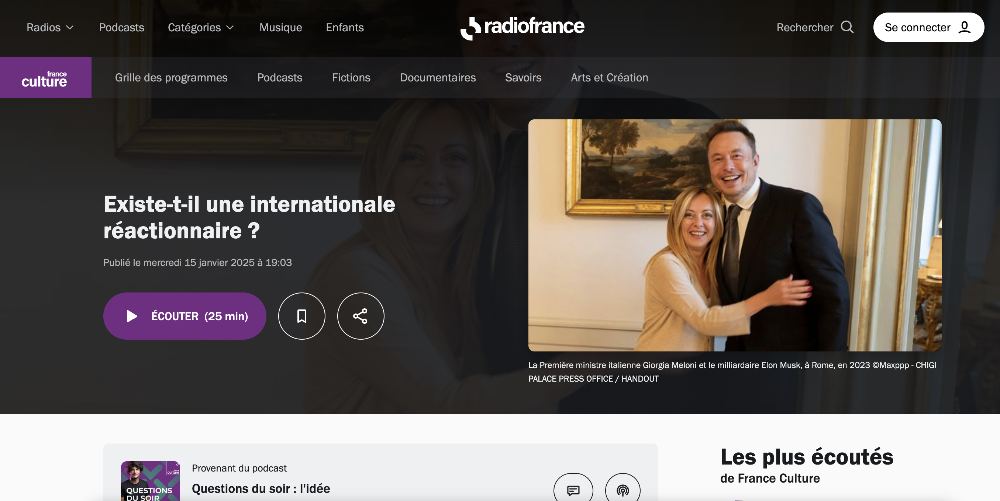

## Une question d'actualité

### L'allégeance de Zuckerberg

## Une question d'actualité

### La nouvelle "olligarchie"

[{fig-align="center" width="567"}](https://www.motherjones.com/politics/2024/01/american-oligarchy/)

## Une question d'actualité

### Le techno-fascisme

<iframe src="https://www.facebook.com/plugins/video.php?height=476&amp;href=https%3A%2F%2Fwww.facebook.com%2Freel%2F3043458065845058%2F&amp;show_text=false&amp;width=267&amp;t=0" width="267" height="476" style="border:none;overflow:hidden" scrolling="no" frameborder="0" allowfullscreen="true" allow="autoplay; clipboard-write; encrypted-media; picture-in-picture; web-share" allowFullScreen="true">

</iframe>

## Besoin d'un retour en arrière {background-color="#173541"}

### L'imaginaire d'Internet

## 1950 : la capacité de calcul, une ressource rare

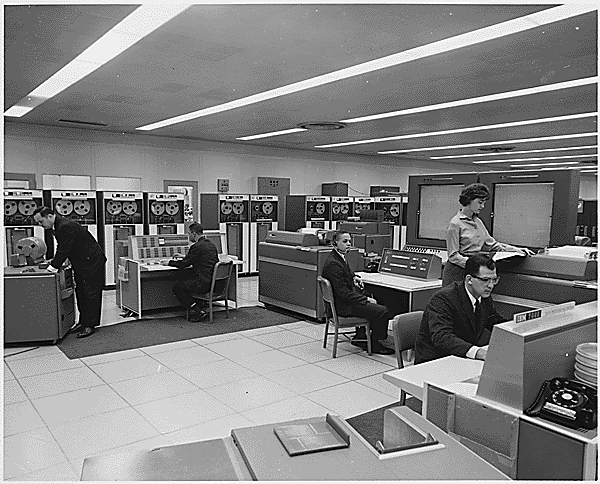

## 1962 : la conception d'un réseau décentralisé

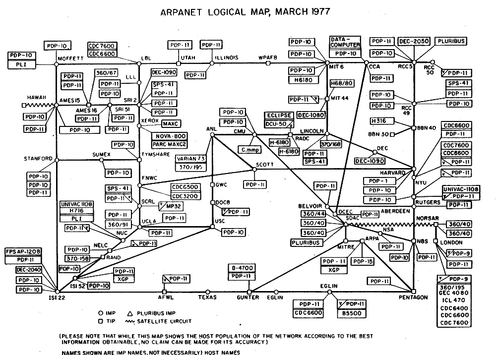{width="965"}

## 1969 : un réseau conçu par consensus

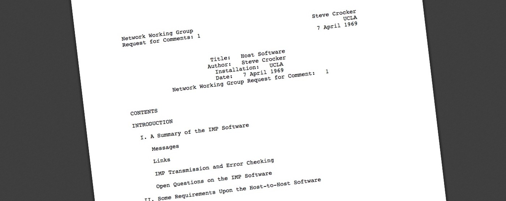

## L'étrange rencontre entre hippies et ingénieurs {background-color="#173541"}

::::: columns
::: {.column .text-white width="50%"}
Extrait de Fred Turner, *Aux sources de l'utopie numérique* 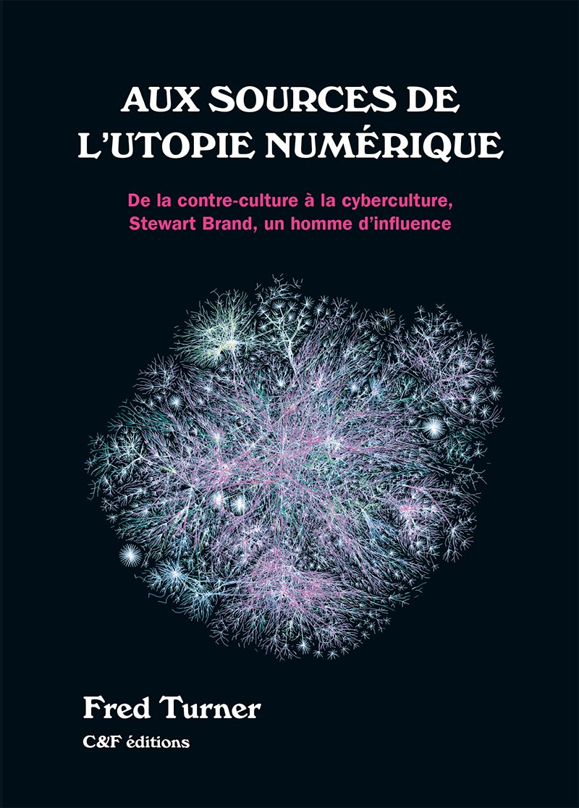{width="300"}
:::

::: {.column .text-white width="50%"}
**2 questions à préparer**

1.  Quel rôle ont joué les publications de Stewart Brand dans la rencontre entre la contre-culture et l'industrie de la tech ?

2.  Peut-on parler de récupération de la contre-culture par l'industrie de la tech ?
:::
:::::

## L'héritage de la pensée cybernétique

::::: columns
::: {.column width="50%"}
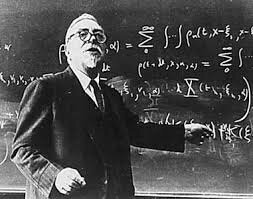
:::

::: {.column width="50%"}
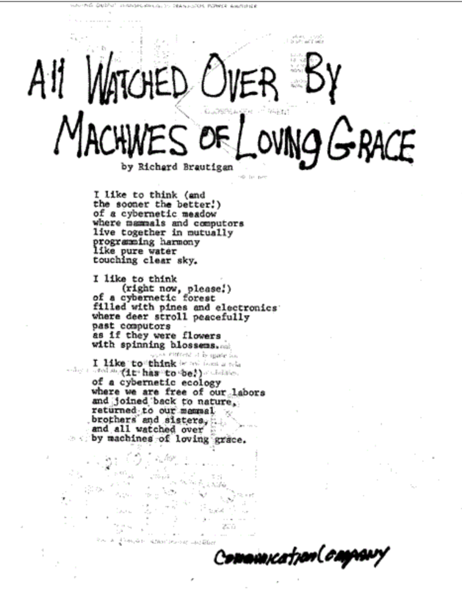
:::
:::::

## Le Whole Earth Catalog et le WELL

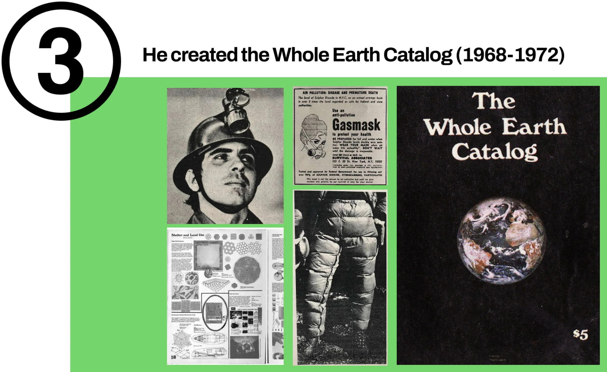

[5 Ways Stewart Brand Changed Our Lives](https://noahny.com/blogs/news/5-ways-stewart-brand-changed-our-lives)

## La cybernétique : une idéologie encore bien présente {background-color="#173541"}

::::: columns
::: {.column .text-white width="50%"}
Extrait de Philippe Breton, *L'Utopie de la communication* 

{width="300"}
:::

::: {.column .text-white width="50%"}
**3 questions à préparer**

1.  Pourquoi la cybernétique voue-t-elle un tel culte de la communication ?

2.  Quel rôle joue l'informatique dans l'utopie cybernétique ?

3. Quel résonnance de ce texte avec le monde contemporain ?
:::
:::::

## 
<iframe allowfullscreen frameborder="0" height="100%" mozallowfullscreen style="min-width: 500px; min-height: 355px" src="https://app.wooclap.com/events/FXBNBC/questions/69715bc772cf78a919e4a3e3" width="100%"></iframe>

## L'éthique hacker
#### A quoi ça vous fait penser ? {style="color: #E95459;"}
<iframe allowfullscreen frameborder="0" height="100%" mozallowfullscreen style="min-width: 500px; min-height: 355px" src="https://app.wooclap.com/events/FXBNBC/questions/69715cc1cd3b15fcf0bb5811" width="100%"></iframe>

## L'éthique hacker

::::: columns
::: {.column width="30%"}
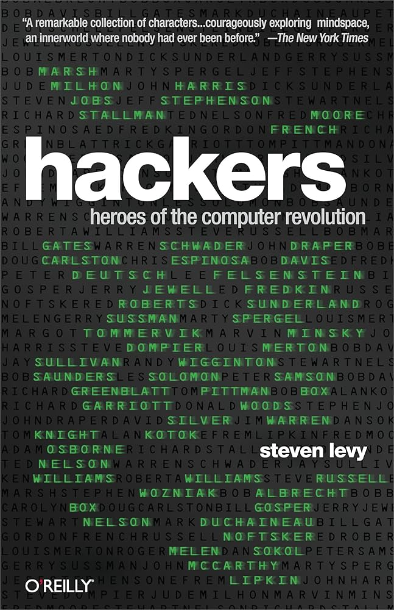
:::

::: {.column width="70%"}
Né au MIT, à Boston, à la fin des années 1970, le hacking (de l'anglais to hack : bidouiller) désigne une relation particulière à la technologie. Le journaliste Steven Levy résume cette éthique en 5 points :

1.  Le hacker est curieux, il veut pouvoir explorer et manipuler les technologies
2.  L'information doit être libre.
3.  Le hacker se méfie de l'autorité et privélgie la décentralisation.
4.  Le hacker doit être jugé selon ses hacks, selon son mérite.
5.  Les ordinateurs peuvent améliorer la vie et produire des choses belles et esthétiques.

in Dominique Cardon, *Culture numérique*, presses de Sciences Po, 2019.
:::
:::::

## L'éthique hacker {background-color="#173541"}

:::: {.columns}

::: {.column .text-white width="40%"}
Lecture de l'extrait de la lettre aux investisseurs de Mark Zuckerberg (2012)
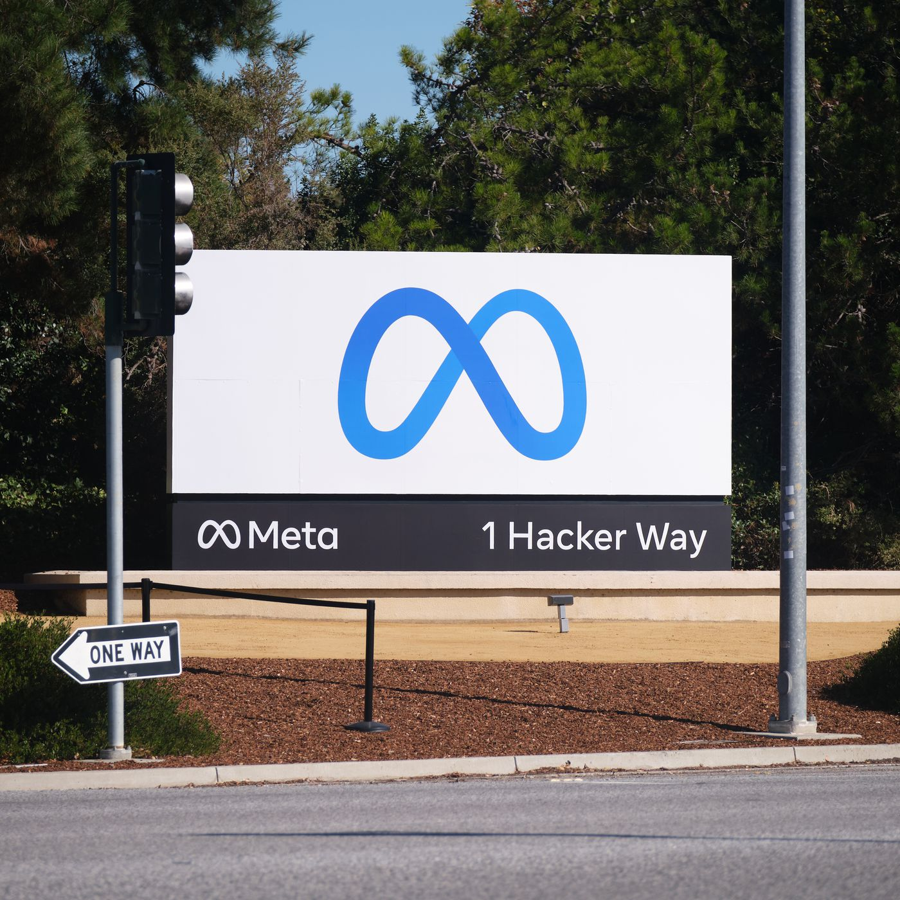{fig-align="center"}
:::

::: {.column .text-white width="60%"}
2 questions : 

1. Que reste-t-il selon vous de la cybernétique dans la mission de Facebook ?

2. Qu'est-ce qu'il y a de politique dans la valorisation du hack ?
:::

::::

## 

<iframe allowfullscreen frameborder="0" height="100%" mozallowfullscreen style="min-width: 500px; min-height: 355px" src="https://app.wooclap.com/events/FXBNBC/questions/69715bc772cf78a919e4a3e3" width="100%"></iframe>

## L'émergence du "cyber-libertarianisme"

::::: columns
::: {.column width="50%"}
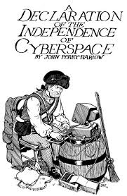
:::

::: {.column width="50%"}
> Gouvernements du monde industriel, géants fatigués de chair et d'acier, je viens du cyberespace, nouvelle demeure de l'esprit. Au nom de l'avenir, je vous demande, à vous qui êtes du passé, de nous laisser tranquilles. Vous n'êtes pas les bienvenus parmi nous. Vous n'avez aucun droit de souveraineté sur nos lieux de rencontre.

[Déclaration d'indépendance du cyberespace](https://fr.wikipedia.org/wiki/D%C3%A9claration_d%27ind%C3%A9pendance_du_cyberespace), John Perry Barlow, 1996
:::
:::::

## 3 idéologies au coeur de la Silicon Valley {background-color="#173541"}

::::: columns
::: {.column .text-white width="40%"}
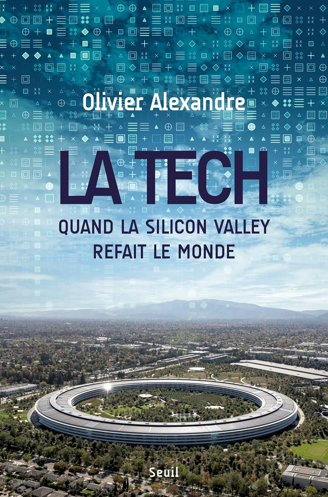{fig-align="center"}
:::

::: {.column .text-white width="60%"}
**3 questions : **

1. Qu'est ce qui réunit ces trois idéologies ? 

2. Comment s'est faite la jonction entre libertarianisme et la Silicon Valley ?

3. Comment résumeriez-vous le projet politique du longtermisme ? 

:::
:::::

##

<iframe allowfullscreen frameborder="0" height="100%" mozallowfullscreen style="min-width: 500px; min-height: 355px" src="https://app.wooclap.com/events/FXBNBC/questions/697212cb8dcfe03005b29e64" width="100%"></iframe>

## Brand : le père du long-termisme ?

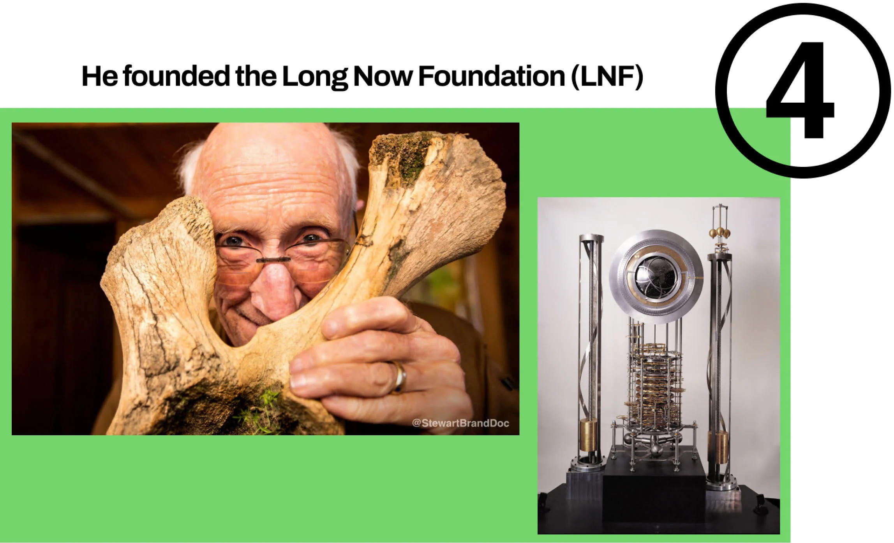

## Le longtermisme : la nouvelle philosophie pour justifier les excès de la tech {.text-white background-color="#173541"}

::::: columns
::: {.column width="50%"}
Extrait de la revue _Tèque_ 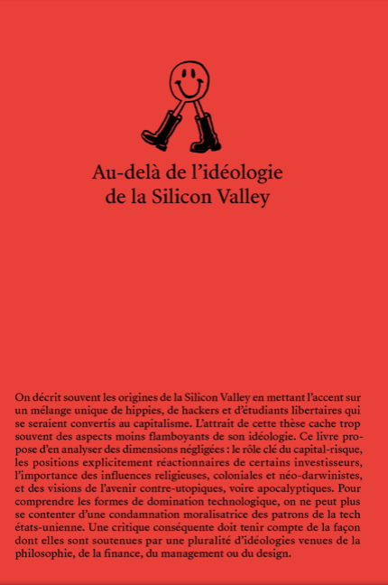{width="288"}
:::

::: {.column .text-white width="50%"}
2 questions à préparer :

1. Quelles sont les critiques adressées par l'auteur au longtermisme ? 

2. Que signifie le "Jackpot longtermiste" ?

:::
:::::

## 

## [Pour finir :]{style="color: #E95459;"} la Paypal Mafia

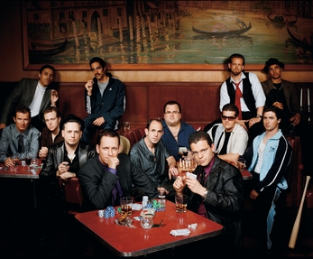

## Musk et la Paypal Mafia

[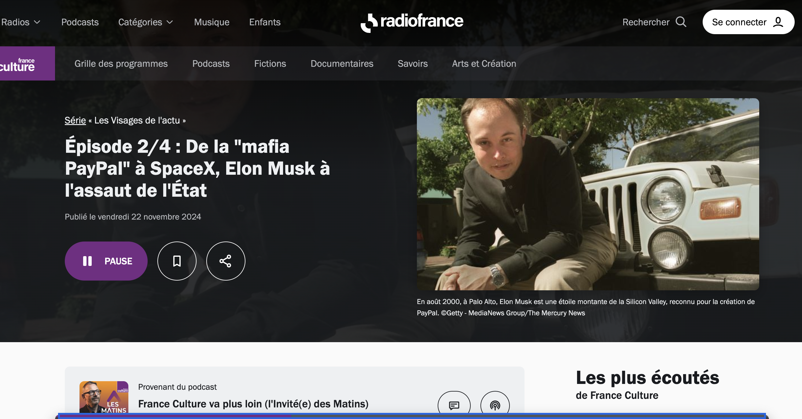{fig-align="center"}](https://www.radiofrance.fr/franceculture/podcasts/france-culture-va-plus-loin-l-invite-e-des-matins/de-la-mafia-paypal-a-spacex-elon-musk-a-l-assaut-de-l-etat-4657289)

## JD Vance, l'héritier de la Paypal Mafia

[{fig-align="center"}](https://www.france.tv/documentaires/documentaires-societe/8056980-j-d-vance-la-revanche-d-une-amerique.html)

# La mise en données du monde {background-color="#173541"}

## La mise en données du monde {background-color="#173541"}

### [c'est quoi pour vous ?]{style="color: #E95459;"}

## La mise en données du monde {background-color="#173541"}

::::: columns
::: {.column width="50%"}
[Extrait : Kenneth Cukier & Viktor Mayer-Schönberger (2013), "Mise en données du monde, le déluge numérique", Le Monde Diplomatique.]{style="color: #E95459;"}

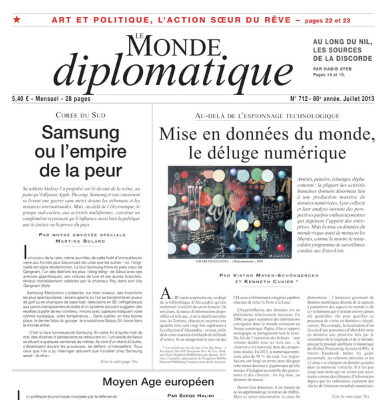
:::

::: {.column .text-white width="50%"}
2 questions :

1.  Qu'est ce que la datafication ou mise en données du monde ?

2.  Qu'est ce qui change avec la mise en données du monde ?

**Question bonus : peut-on échapper à la mise en données du monde ?**
:::
:::::

## 
<iframe allowfullscreen frameborder="0" height="100%" mozallowfullscreen style="min-width: 500px; min-height: 355px" src="https://app.wooclap.com/events/FXBNBC/questions/69779940fb0c52728a9382ec" width="100%"></iframe>

## Faire exister le vivant avec des données

<iframe width="560" height="500" src="https://www.youtube.com/embed/rwAKMs_54pI?si=gWYjVivhxrmfr-km" title="YouTube video player" frameborder="0" allow="accelerometer; autoplay; clipboard-write; encrypted-media; gyroscope; picture-in-picture; web-share" referrerpolicy="strict-origin-when-cross-origin" allowfullscreen>

</iframe>

## Les données, une histoire pas si récente {background-color="#173541"}

::::: columns
::: {.column width="50%"}
[Extrait : Serge Abiteboul & Valérie Peugeot, *Terra data : qu'allons nous faire des données numériques ?*, Le Pommier, 2017.]{style="color: #E95459;"}

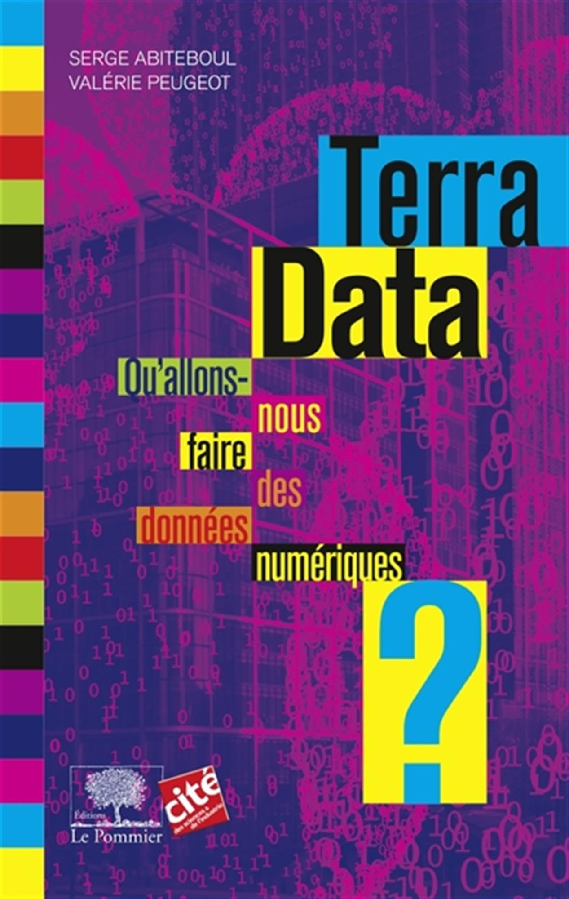{width="200"}
:::

::: {.column .text-white width="50%"}
**3 questions :**

1.  Quel est le lien entre la mise en données du monde et l'histoire de l'écriture ?

2.  C'est quoi une trace numérique ?

3.  Qu'est ce qui différencie une donnée de l'information et de la connaissance ?
:::
:::::

##
<iframe allowfullscreen frameborder="0" height="100%" mozallowfullscreen style="min-width: 500px; min-height: 355px" src="https://app.wooclap.com/events/FXBNBC/questions/6977996698238314007085e7" width="100%"></iframe>

## Les données et les faits {background-color="#173541"}

::::: columns
::: {.column .text-white width="50%"}
Extrait de Rosenberg, "Data before the facts"

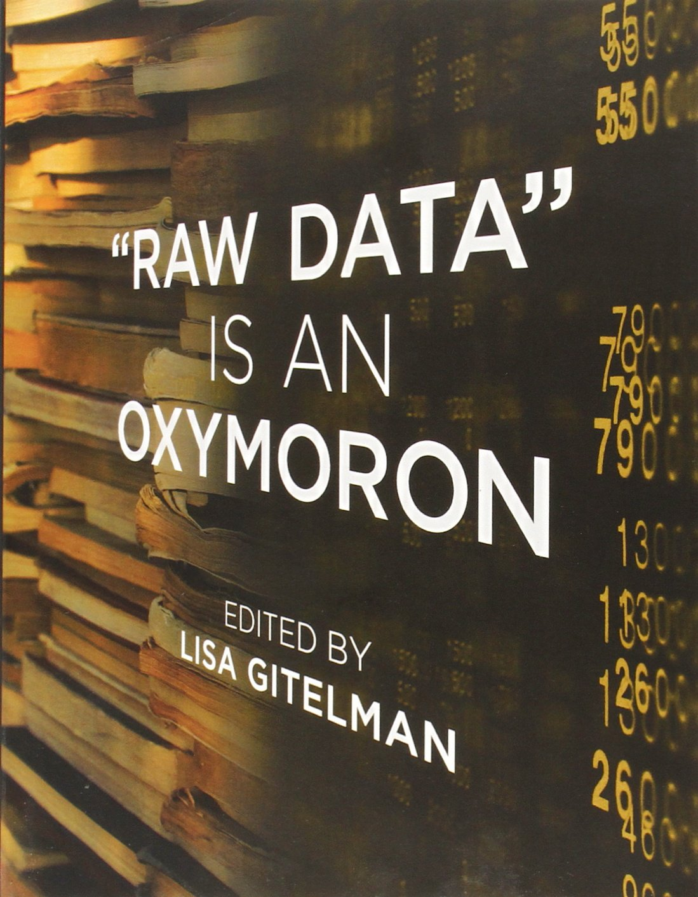{width="200"}
:::

::: {.column .text-white width="50%"}
1.  C'est une quoi une donnée à la base ?

2.  Comment a évolué la définition du terme ?

3.  Qu'est ce qui est resté de cette définition ? Pourquoi parle-t-il d'une valeur rhétorique des données ?
:::
:::::

## 
<iframe allowfullscreen frameborder="0" height="100%" mozallowfullscreen style="min-width: 500px; min-height: 355px" src="https://app.wooclap.com/events/FXBNBC/questions/69779982c8660dfc0d5ecdad" width="100%"></iframe>

## Knowledge is power ?

<iframe width="560" height="500" src="https://www.youtube.com/embed/OyytdYzy3eA?si=YgulMrdiaS8V_hAk" title="YouTube video player" frameborder="0" allow="accelerometer; autoplay; clipboard-write; encrypted-media; gyroscope; picture-in-picture; web-share" referrerpolicy="strict-origin-when-cross-origin" allowfullscreen>

</iframe>

## Les traces numériques, une obsession contemporaine {background-color="#173541"}

::::: columns
::: {.column width="50%"}
{width="341"}
:::

::: {.column .text-white width="50%"}

Comment comprendre l'expression "société de la trace" utilisée à la fin du texte ?

Le texte suggère que le pouvoir a "besoin absolu de notre libre arbitre". Pourquoi ?
:::
:::::

## 
<iframe allowfullscreen frameborder="0" height="100%" mozallowfullscreen style="min-width: 500px; min-height: 355px" src="https://app.wooclap.com/events/FXBNBC/questions/697799ecdf85d5c60ebf3bd6" width="100%"></iframe>

# L'Etat plateforme {background-color="#173541"}

## Mais au fait...

### [C'est quoi une plateforme ?]{style="color: #E95459;"}

## Les plateformes numériques {background-color="#173541"}

::::: columns
::: {.column width="50%"}
[Jean-Samuel Beuscart et Patrice Flichy, "Plateformes numériques", Réseaux, 2018/6 n° 212]{style="color: #E95459;"}

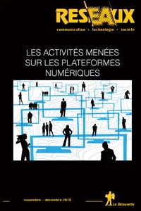
:::

::: {.column .text-white width="50%"}
-   Quel est l'historique de la notion de plateforme ? D'où vient ce terme ?

-   Qu'est ce qui différencie les plateformes numériques ?

-   Quel est l'ambiguïté de la notion de plateforme selon Gilepsie ?
:::
:::::

## 
<iframe allowfullscreen frameborder="0" height="100%" mozallowfullscreen style="min-width: 500px; min-height: 355px" src="https://app.wooclap.com/events/FXBNBC/questions/697a7d17b7f55b47e8662cb5" width="100%"></iframe>

## Government as a platform {background-color="#173541"}

::::: columns
::: {.column .text-white width="50%"}
[Tim O'Reilly, "Government as a platform" in Lathrop & Ruma, eds. (2010), Open Government: collaboration, transparency and participation in practice, O'Reilly.]{style="color: #E95459"}

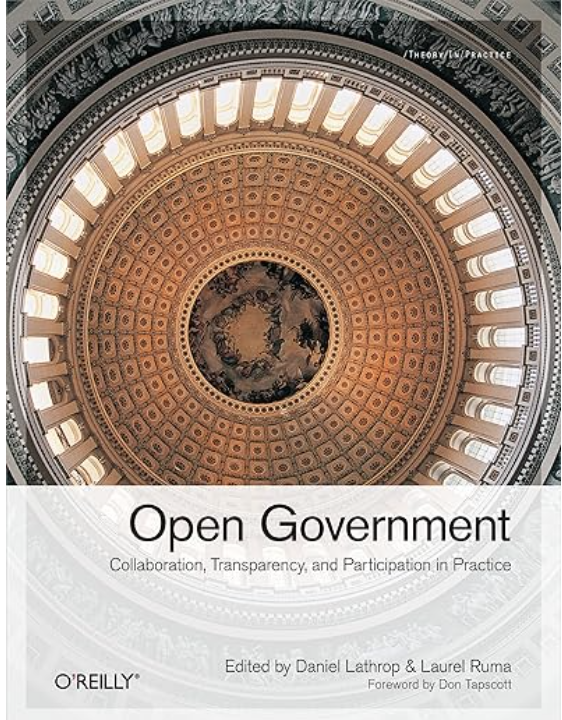{width="300"}
:::

::: {.column .text-white width="50%"}
-   Quelles métaphores utilise-t-il pour justifier la notion d'Etat plateforme ?

-   Qu'est ce que l'Etat plateforme ? Comment ça se traduit concrètement ?

-   Où trouve-t-on dans le texte l'influence du cyberlibertarianisme ?
:::
:::::

##
<iframe allowfullscreen frameborder="0" height="100%" mozallowfullscreen style="min-width: 500px; min-height: 355px" src="https://app.wooclap.com/events/FXBNBC/questions/697a7d350faa6737f01dde2e" width="100%"></iframe>

## L'Etat plateforme : traduction et mise en politique publique d'une idée {background-color="#173541"}

::::: columns
::: {.column width="50%"}
[Extrait : Pierre Pezziardi & Henri Verdier, "Des startups d'Etat à l'Etat plateforme", fondation pour l'innovation politique, 2016]{style="color: #E95459;"}

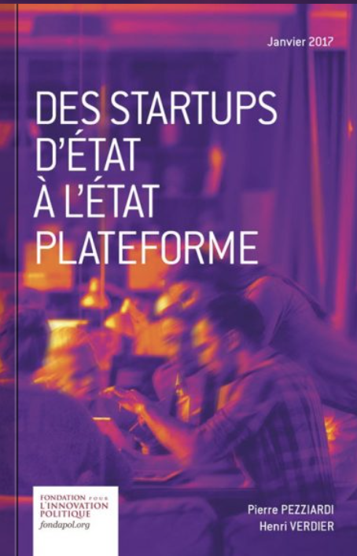{width="200"}
:::

::: {.column .text-white width="50%"}
-   Quelles comparaisons font-ils avec les géants du web ?

-   Comment traduisent-ils la notion de government as a platform ? Voit-on des différences ?

-   Comment veulent-ils marquer une rupture ?
:::
:::::

##
<iframe allowfullscreen frameborder="0" height="100%" mozallowfullscreen style="min-width: 500px; min-height: 355px" src="https://app.wooclap.com/events/FXBNBC/questions/697a7d580faa6737f01e13ca" width="100%"></iframe>

## Les startups d'Etat

Voir aussi le site de beta.gouv.fr : <https://beta.gouv.fr/approche>

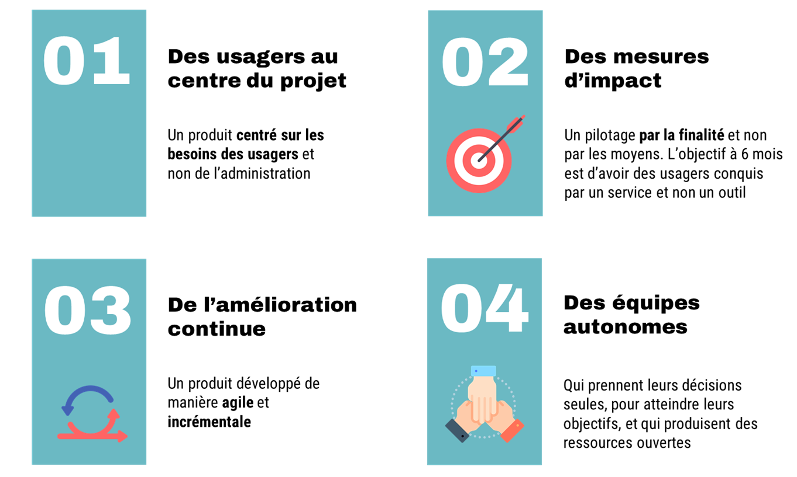{fig-align="center"}

## Un exemple de traduction de l'Etat plateforme : [France Connect]{style="color: #E95459;"} {background-color="#173541"}

::::: columns
::: {.column width="50%"}
[Alauzen, M. (2019) . L'État plateforme et l'identification numérique des usagers Le processus de conception de FranceConnect. *Réseaux*, n° 213(1), 211-239.]{style="color: #E95459;"}

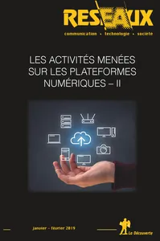{width="200"}
:::
 
::: {.column .text-white width="50%"}
-   Avec quelle approche de recherche l'autrice appréhende-t-elle la notion d'Etat plateforme ?

-   C'est quoi France Connect ? Comment est-il emblématique de l'Etat plateforme ?

-   Pourquoi est-ce une épreuve d'Etat ?
:::
:::::

##

<iframe allowfullscreen frameborder="0" height="100%" mozallowfullscreen style="min-width: 500px; min-height: 355px" src="https://app.wooclap.com/events/FXBNBC/questions/697a7d7e175950e2d04878f7" width="100%"></iframe>

# La transparence des algorithmes publics {background-color="#173541"}

## C'est quoi un algorithme ?

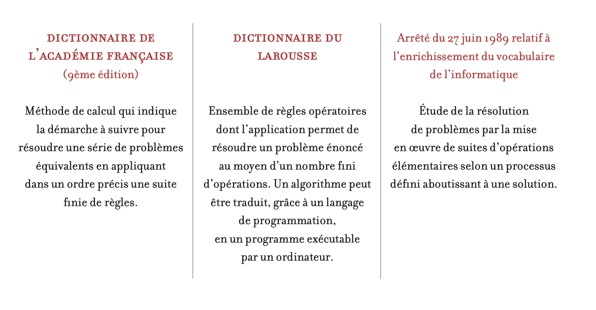

Source : Observatoire Data Publica

## Une définition officielle

::::: columns
::: {.column width="50%"}
> «Un algorithme est la description d'une suite d'étapes permettant d'obtenir un résultat à partir d'éléments fournis en entrée.»
:::

::: {.column width="50%"}
-   La « **description** » du modèle algorithmique peut être écrite en langage naturel (c'est-à-dire parlé par l'être humain). La transparence algorithmique : décrire une « suite d'étapes » qui suivent un ordre déterminé, une logique

-   L'algorithme, c'est le traitement que suivent des « éléments fournis en entrée pour donner un "**résultat**"" qui doit répondre à un objectif fixé.

-   Les « éléments fournis en entrée» sont les « **données** ». Elles sont importantes pour la description des algorithmes : leur origine, leur qualité, leurs caractéristiques vont avoir un impact sur le résultat.
:::
:::::

## Un algorithme = une recette ?

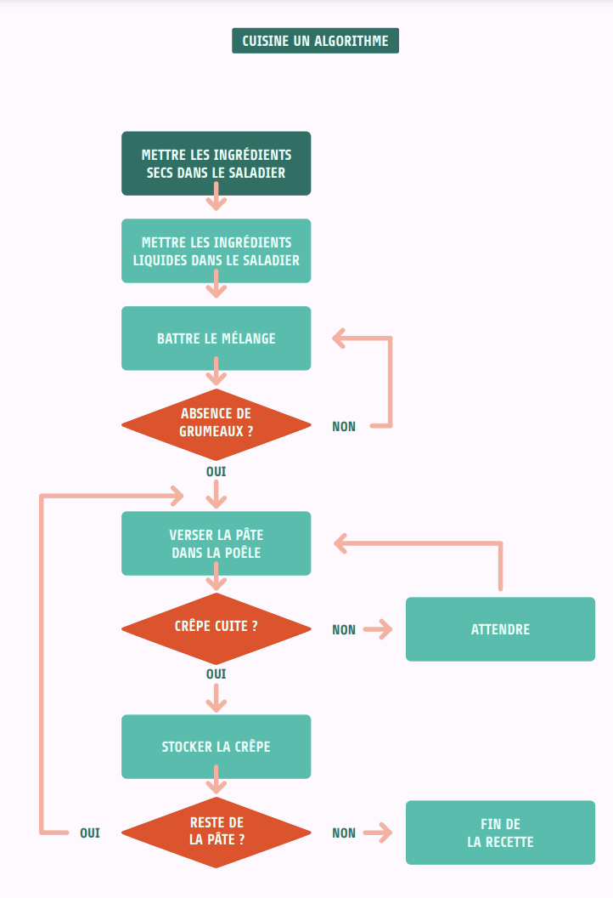{fig-align="center" width="592"}

Source : [Datalireladata](http://datalireladata.com/s/cuisine-un-algorithme_guide_scolaire.pdf)

## Un extrait pour comprendre ces questions {background-color="#173541"}

::::: columns
::: {.column .text-white width="50%"}
Extrait de **Défenseur des droits, *Algorithmes, systèmes d’IA et services publics : quels droits pour les usagers ? Points de vigilance et recommandations*, 2024.**

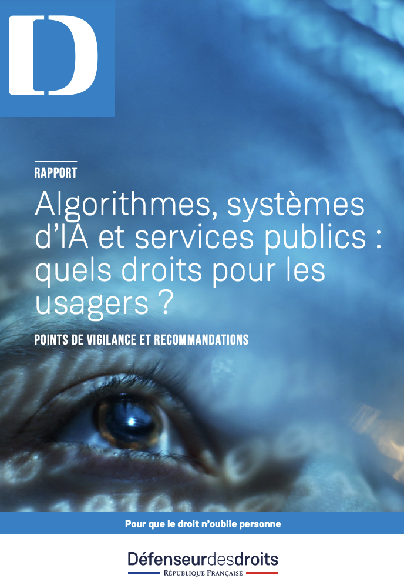{width="200"}
:::

::: {.column .text-white .text-white width="50%"}
1.  Quelle est la différence entre un algorithme fermé et un algorithme apprenant ?

2.  Qu'est ce qui différencie l'IA des algorithmes ?

3.  Quels avantages trouve l'adminstration à utiliser des algorithmes ?
:::
:::::

##
<iframe allowfullscreen frameborder="0" height="100%" mozallowfullscreen style="min-width: 500px; min-height: 355px" src="https://app.wooclap.com/events/FXBNBC/questions/6980d3c40be85ebb31c1f591" width="100%"></iframe>

## Les usages des algorithmes

::::: columns
::: {.column width="50%"}
Selon la CNIL (2017) : 

- Générer de la connaissance 

- Faire du matching 
- Prédire 
- Recommander 
- Aider à la décision
:::

::: {.column width="50%"}
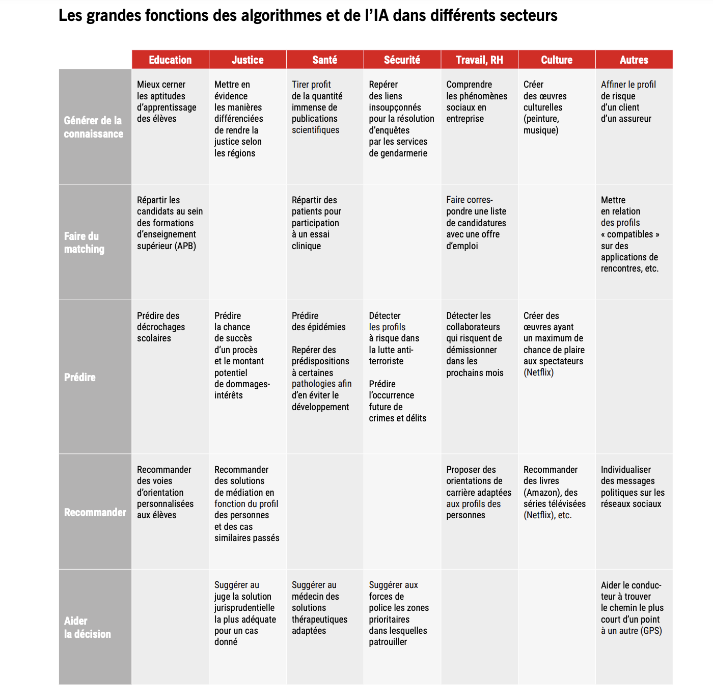
:::
:::::

## Focus sur les usages des algorithmes publics

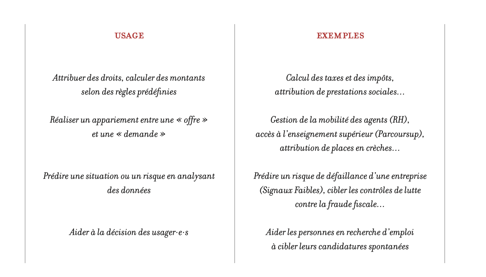

Source : Observatoire Data Publica & Etalab

## L'observatoire des algorithmes publics

::::: columns
::: {.column width="50%"}
[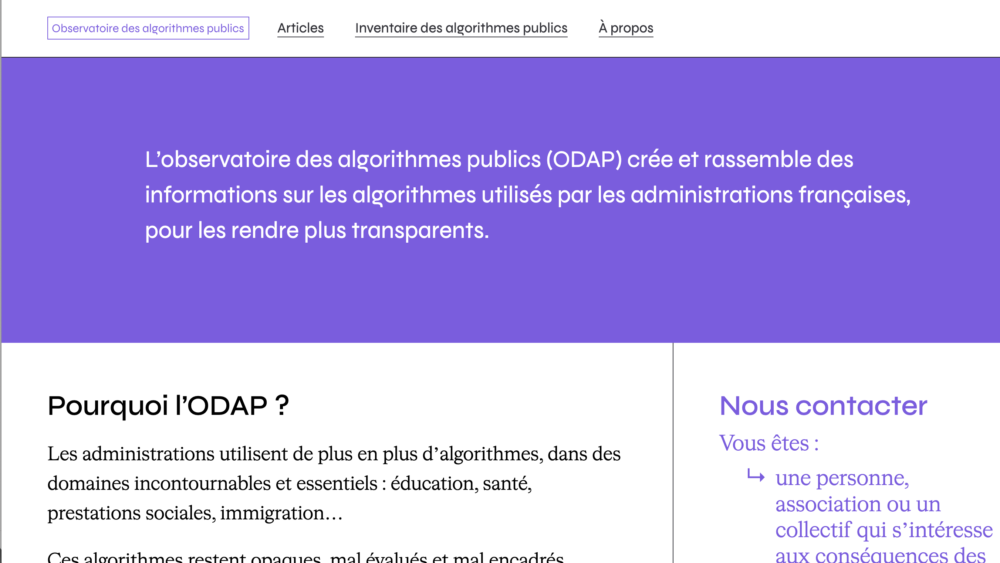](https://odap.fr/inventaire/synthese/)
:::

::: {.column width="50%"}
Sur Wooclap, indiquez l'algorithme quel algorithme vous trouvez :

1.  révoltant

2.  utile

3.  intriguant
:::
:::::

## 
<iframe allowfullscreen frameborder="0" height="100%" mozallowfullscreen style="min-width: 500px; min-height: 355px" src="https://app.wooclap.com/events/FXBNBC/questions/6980d4170be85ebb31c2a330" width="100%"></iframe>

## Un exemple méconnu : le bouton poussoir aux passages piétons

[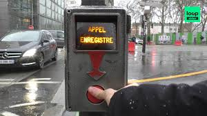{fig-align="center" width="600"}](https://www.facebook.com/Loopsider/videos/le-bouton-poussoir-des-passages-pi%C3%A9tons-sert-il-%C3%A0-quelque-chose-/1169096853248688/?locale=fr_FR)

## Un cas d'étude : l'algorithme local de Parcoursup à Sciences Po Bordeaux {background-color="#173541"}

::::: columns
::: {.column width="50%"}
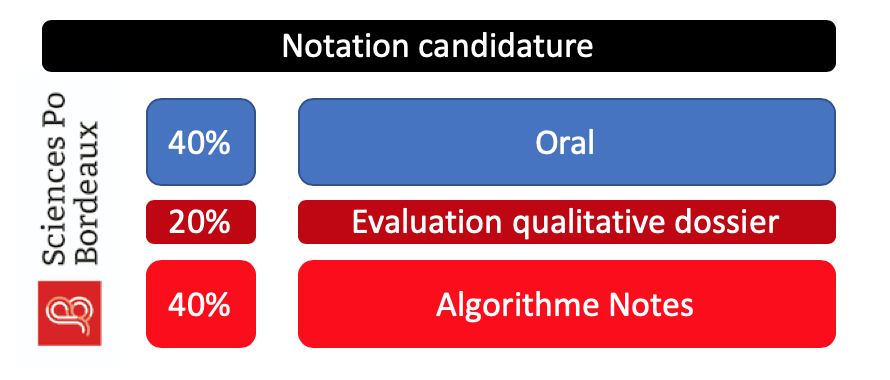
:::

::: {.column .text-white width="50%"}
1.  Pourquoi Sciences Po Bordeaux a développé son propre algorithme ?

2.  Comment fonctionne cet algorithme local ?
:::
:::::

## Un exemple extreme : le score coeur {background-color="#173541"}

::::: columns
::: {.column .text-white width="50%"}
Henin, C. (2021) . Confier une décision vitale à une machine. Réseaux, N° 225(1), 187-213.

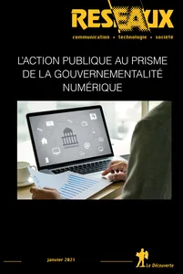
:::

::: {.column .text-white width="50%"}
1.  Pourquoi l'ABM a-t-elle conçu cet algorithme ?

2.  Qu'avez vous compris de son fonctionnement ?

3.  Quels avantages les médecins tirent-ils de cet algorithme ?
:::
:::::

##
<iframe allowfullscreen frameborder="0" height="100%" mozallowfullscreen style="min-width: 500px; min-height: 355px" src="https://app.wooclap.com/events/FXBNBC/questions/6980d474125ba90318b6759e" width="100%"></iframe>

# L'intelligence artificielle {background-color="#173541"}

## L'arpentage : une méthode de lecture collective

:::: {.column width="50%"}
::: incremental
-   Né dans les cercles ouvriers à la fin du XIXe siècle

-   Utilisé par les résistants pendant la Seconde Guerre mondiale

-   Une méthode de lecture collective pour rendre le savoir accessible
:::
::::

:::: {.column width="50%"}
::: incremental
**Les objectifs :**

-   Désacraliser le savoir et l'objet livre
-   Rendre accessible la pensée des auteurs
-   Partager les opinions de façon égalitaire
-   Libérer la parole sur des sujets politiques
:::
::::

## Les étapes de l'arpentage

::::::: columns
:::: {.column width="60%"}
::: incremental
1.  **Le découpage du livre**
    -   Division de l'ouvrage en parties
    -   Distribution aux participants
    -   Désacralisation de l'objet
2.  **La lecture individuelle**
    -   Temps personnel de lecture
    -   Identification des idées clés
    -   Prise de notes
3.  **La restitution collective**
    -   Partage des lectures
    -   Échange d'expériences
    -   Construction collective du savoir
:::
::::

:::: {.column width="40%"}
::: red
💡 L'arpentage permet l'accès au savoir sans barrière financière : pas besoin d'acheter le livre !
:::

*Une méthode toujours encadrée par un animateur qui facilite les échanges.*
::::
:::::::

## Le livre étudié

::::::: columns
:::: {.column width="60%"}
::: incremental
-   Une **cartographie critique** de l'IA comme système de pouvoir
    -   Ressources naturelles et impact environnemental
    -   Exploitation du travail humain invisible
    -   Biais et discriminations des systèmes
    -   Classification et surveillance des populations
-   Un regard sur l' \[anatomie politique et matérielle de l'IA plutôt que sur ses promesses techniques
:::
::::

:::: {.column width="40%"}
{width="250"}

::: red
🔍 Un livre dense qui se prête particulièrement bien à l'arpentage collectif pour en explorer toutes les dimensions !
:::
::::
:::::::

## Découverte du livre {background-color="#173541"}

::: {.column .text-white width="40%"}
#### Lisons ensemble un extrait de [l'introduction du livre](https://docs.google.com/document/d/1mEo62Q81vgjMhsEOcwKYrIPo6ibFogtw2TZE6MB6XnA/edit?tab=t.0) (30 min)
:::

::: {.column .text-white width="60%"}
Consignes :

1.  lisez l'introduction du livre dans son ensemble (5 pages)

2.  Chacun·e d'entre vous, commentez une ou deux phrases qui vous paraissent les plus intéressantes d' l'extrait et dites pourquoi en commentaire. Si la phrase a déjà été commentée, répondez en commentaire.
:::

## Arpentage des chapitres en groupe {background-color="#173541"}

::: {.column .text-white width="40%"}
{width="300"}
:::

::: {.column .text-white width="60%"}
**Consignes :**

1.  Répartissez vous en 6 groupes de taille équivalente\
2.  Lisez l'essentiel du chapitre en 25 minutes, sautez à la conclusion quand la fin approche\
3.  Complétez avec le groupe la fiche arpentage en 15 minutes : les 3 idées essentielles, 2 citations, aimé/pas aimé\
4.  Restituez votre arpentage en 3 min par groupes
:::

# Des questions ? {background-color="#173541"}

Contact : [samuel.goeta\@sciencespo-aix.fr](mailto:samuel.goeta@sciencespo-aix.fr)